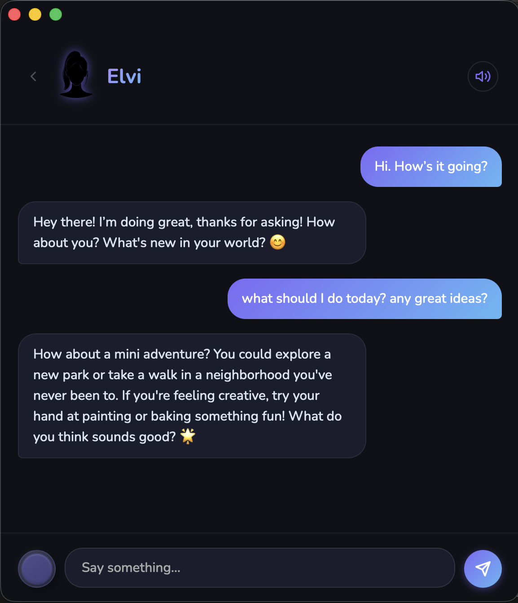

# Elvi

A conversational AI for Mac with real personality and voice.

  
  

## 🎥 Demo

🚀 See it in action (4.5 min)

---

## Features

🎙️ Natural voice conversation powered by ElevenLabs  
🤖 Three distinct AI personalities  
🎵 Spotify integration — play any song by name  
🌐 Web search and webpage reading  
🚀 NASA imagery and space exploration  
🖼️ Art from the Met Museum and Art Institute of Chicago  
📰 Hacker News and Wikipedia daily events  

---

## Built With

- **Rust** + **Tauri** — native Mac desktop app
- **OpenAI GPT-4o-mini** — conversation and tool calling
- **ElevenLabs** — realistic AI voices
- **Apple Speech Recognition** — on-device speech recognition

---

## 💡 About this project

The goal was to build a voice assistant that feels more natural and engaging than typical chat interfaces.
It combines real-time speech, tool integrations, and distinct personalities to create a more human-like experience.

If you’re interested in how it works, check out the code or feel free to ask questions!
